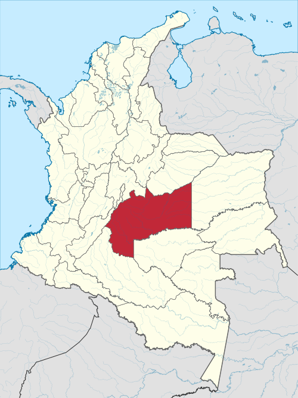

# Título del Proyecto

**Análisis multitemporal de zonas inundables en el departamento del Meta mediante imágenes SAR Sentinel-1 y Google Earth Engine**

> Proyecto Final  
> Maestría en Geomática  
> Programación en SIG  
> Docente: Alexys H. Rodríguez-Avellaneda Ph.D.

---

# Introducción y Justificación

## Definición del problema

El departamento del Meta, ubicado en el piedemonte llanero de Colombia, presenta una recurrencia importante de eventos de inundación asociados a la dinámica del río Meta y de sus principales afluentes. La transición entre la cordillera Oriental y las planicies de la Orinoquia favorece crecientes súbitas, desbordamientos y anegamientos que afectan municipios como Villavicencio, Acacías, Puerto López y Puerto Gaitán. Estos eventos generan impactos sobre la movilidad, las actividades agropecuarias, la infraestructura y las comunidades asentadas en zonas bajas y cercanas a cauces.

Aunque existen insumos institucionales para el análisis del riesgo, en muchos casos la cartografía disponible no refleja con suficiente detalle la variación temporal de las inundaciones ni permite identificar de forma sencilla qué sectores se han inundado con mayor frecuencia en la última década. Por ello, resulta pertinente plantear un enfoque multitemporal que permita pasar de una visión estática del fenómeno a una lectura histórica de su comportamiento espacial.

El uso de imágenes SAR Sentinel-1 es especialmente adecuado para esta problemática porque el radar puede adquirir información aun en presencia de nubosidad, una condición frecuente durante las temporadas lluviosas en el Meta. A diferencia de los sensores ópticos, el radar mantiene capacidad de observación cuando suelen ocurrir los eventos de inundación. En superficies cubiertas por agua, la retrodispersión tiende a disminuir, lo que facilita la identificación de áreas potencialmente inundadas mediante reglas de detección relativamente simples.

En este contexto, Google Earth Engine (GEE) ofrece una alternativa eficiente para procesar grandes volúmenes de imágenes y construir una serie temporal 2015–2024 orientada a estimar la frecuencia histórica de inundación. Desde el punto de vista espacial, este análisis permitiría reconocer patrones de recurrencia, diferenciar sectores con mayor exposición al fenómeno y generar una base cartográfica útil para etapas posteriores de validación e interpretación.

---

# Revisión Bibliográfica Preliminar

## Google Earth Engine como plataforma de análisis

@gorelick2017 describen GEE como una plataforma de análisis geoespacial a escala planetaria que integra grandes volúmenes de datos satelitales y capacidad de cómputo en la nube. Su uso es especialmente útil cuando se requiere trabajar con series temporales largas y con múltiples escenas, como ocurre con Sentinel-1.

## Detección de inundaciones con SAR Sentinel-1

@devries2020 presentan un enfoque de detección de inundaciones basado en estadísticas multitemporales de retrodispersión SAR implementado en GEE. El trabajo muestra que el análisis histórico de la señal mejora la capacidad de distinguir áreas inundadas frente a evaluaciones basadas en una sola fecha.

@vanama2020 proponen el framework GEE4FLOOD, el cual emplea umbralización automática sobre imágenes Sentinel-1 dentro de GEE. Este antecedente resulta relevante porque demuestra la viabilidad de construir flujos de trabajo reproducibles para eventos de inundación a partir de datos radar de libre acceso.

El protocolo institucional de @unspider2023 también respalda el uso de Sentinel-1 y de GEE para cartografiar inundaciones, resaltando el valor de la polarización VH y de procedimientos de suavizado para reducir el efecto *speckle*.

## Mapeo histórico de agua superficial

@pekel2016 desarrollaron el dataset JRC Global Surface Water, que resume décadas de observación Landsat y permite distinguir agua permanente, estacional y cambios históricos de ocurrencia. En este proyecto, dicho producto se plantea como insumo auxiliar para excluir cuerpos de agua permanentes y reducir falsos positivos en la detección SAR.

## Análisis multitemporal frente a análisis monotemporal

@singha2022 muestran que el uso de series temporales SAR mejora el desempeño de los modelos de clasificación frente al uso de una sola imagen, lo que respalda la elección de un enfoque multitemporal. Más que identificar un único evento, la propuesta del presente proyecto busca reconocer la recurrencia espacial de las inundaciones a lo largo del tiempo.

---

# Objetivos

## Objetivo general

Generar un mapa de frecuencia de inundación para el departamento del Meta mediante análisis multitemporal de imágenes SAR Sentinel-1 en Google Earth Engine, utilizando Python y `geemap`, con el fin de identificar y categorizar las zonas de mayor recurrencia de inundación durante el período 2015–2024.

## Objetivos específicos

1. **Construir una serie temporal de detecciones binarias de inundación** a partir de la colección Sentinel-1 disponible en Google Earth Engine para el departamento del Meta, aplicando un preprocesamiento SAR básico y reglas de refinamiento con información auxiliar.

2. **Categorizar y cartografiar las zonas inundables del departamento del Meta** según su frecuencia histórica de ocurrencia, diferenciando sectores de alta, media y baja recurrencia para facilitar su interpretación espacial.

---

# Área de Estudio

## Delimitación geográfica

El área de estudio corresponde al **departamento del Meta**, localizado en la región de la Orinoquia colombiana. Su extensión aproximada es de 85.635 km² y su territorio articula zonas de piedemonte, valles aluviales y planicies, condiciones que favorecen la ocurrencia de inundaciones en distintos contextos geomorfológicos. Para efectos operativos del proyecto, el área de interés (AOI) estará definida por el límite oficial del departamento del Meta, que será utilizado para recortar y procesar todas las capas espaciales.

Dentro del departamento, se espera prestar especial atención a sectores del piedemonte y de llanura aluvial donde históricamente se reportan afectaciones por inundación. No obstante, el procesamiento se realizará inicialmente sobre todo el límite departamental con el fin de mantener una visión integral del fenómeno.

## Mapa de localización

{fig-align="center" width="52%"}

*Fuente de la figura de localización: Wikimedia Commons, usada como apoyo visual preliminar.*

## Carga prevista del AOI oficial

El procesamiento definitivo se realizará con el shapefile oficial del departamento del Meta. El siguiente bloque muestra la forma en que se planea cargar, reproyectar y preparar el AOI dentro del flujo de trabajo:

```python
import ee
import geemap
import geopandas as gpd
import json

# Inicialización de Earth Engine
# ee.Authenticate()
# ee.Initialize(project='your-project-id')

# Cargar shapefile oficial del Meta
meta = gpd.read_file('SHP_META/SHP_META.shp')
meta_wgs84 = meta.to_crs(epsg=4326)

# Conversión a geometría de GEE
meta_json = json.loads(meta_wgs84.to_json())
aoi = ee.FeatureCollection(meta_json).geometry()

print(meta_wgs84.crs)
print(meta_wgs84.total_bounds)
```

::: {.callout-note}
En esta versión del plan se incluye una figura estática de localización para facilitar la salida en HTML y PDF. En la versión de desarrollo, el AOI final se tomará directamente del shapefile oficial del Meta para garantizar coherencia entre la delimitación cartográfica y el procesamiento en GEE.
:::

---

# Fuentes de Datos

## Imágenes satelitales en Google Earth Engine

| Dataset | ID en GEE | Descripción | Resolución |
|---|---|---|---|
| Sentinel-1 SAR | `COPERNICUS/S1_GRD` | Radar banda C, polarizaciones VV/VH | 10 m, 6–12 días |
| JRC Global Surface Water | `JRC/GSW1_4/GlobalSurfaceWater` | Frecuencia histórica de agua superficial | 30 m |
| SRTM DEM | `USGS/SRTMGL1_003` | Modelo digital de elevación | 30 m |
| HydroSHEDS | `WWF/HydroSHEDS/15ACC` | Acumulación de flujo hidrológico | ~500 m |

## Datos institucionales colombianos

| Fuente | Recurso | Uso en el proyecto |
|---|---|---|
| IGAC / DANE | Shapefile del departamento del Meta (`SHP_META.shp`) | Delimitación oficial del AOI |
| CORMACARENA | Registros o puntos históricos de inundación | Validación espacial preliminar |
| IDEAM | Series hidrológicas o información de contexto | Interpretación de la dinámica hídrica |

## Relación entre fuentes de datos y objetivos

- **Sentinel-1 (GEE):** será la fuente principal para construir la serie temporal de detecciones de inundación. Aporta la información base del **Objetivo específico 1**.
- **JRC Global Surface Water (GEE):** se usará para enmascarar agua permanente y mejorar la interpretación de áreas inundadas. Apoya el **Objetivo específico 1**.
- **SRTM (GEE):** permitirá derivar pendiente y excluir zonas donde la acumulación de agua sea menos probable. Apoya el **Objetivo específico 1**.
- **HydroSHEDS:** servirá como insumo complementario para contextualizar la relación entre drenaje y recurrencia de inundación. Apoya el **Objetivo específico 2**.
- **Shapefile oficial del Meta:** definirá el límite del área de estudio y se usará para recortar todas las capas. Aporta al **Objetivo específico 1** y al **Objetivo específico 2**.
- **Registros de CORMACARENA e IDEAM:** funcionarán como información auxiliar para contraste e interpretación de resultados. Aportan al **Objetivo específico 2**.

---

# Metodología Propuesta

## Lenguaje de programación y librerías

El proyecto se desarrollará principalmente en **Python**, combinando librerías orientadas al procesamiento geoespacial local y a la conexión con Google Earth Engine.

| Librería | Función prevista |
|---|---|
| `earthengine-api` | Acceso, filtrado y procesamiento de colecciones en GEE |
| `geemap` | Visualización y apoyo en la interacción con capas de GEE |
| `geopandas` | Lectura, manejo y reproyección del AOI oficial |
| `matplotlib` | Elaboración de figuras estáticas para el informe |
| `numpy` / `pandas` | Estadísticas, tablas y organización de resultados |

## Descripción general de la metodología

### Fase 1 — Preparación del área de estudio

Se cargará el shapefile oficial del departamento del Meta, se verificará su sistema de referencia y se reproyectará a WGS84 para su integración con Google Earth Engine. Esta fase garantiza que todas las capas trabajen sobre una misma delimitación espacial.

### Fase 2 — Consulta y filtrado de Sentinel-1

Se construirá una colección temporal de imágenes Sentinel-1 entre 2015 y 2024, filtrando por área de estudio, modo de adquisición y polarización de interés. El propósito es consolidar una base homogénea para el análisis multitemporal.

```python
def preprocesar_sar(img):
    """
    Ejemplo de preprocesamiento: suavizado y umbral simple
    para detectar superficies con baja retrodispersión.
    """
    suavizado = img.focal_mean(50, 'circle', 'meters')
    agua = suavizado.lt(-15).rename('agua')
    return agua.copyProperties(img, ['system:time_start'])

sar = ee.ImageCollection('COPERNICUS/S1_GRD') \
    .filterBounds(aoi) \
    .filterDate('2015-01-01', '2024-12-31') \
    .filter(ee.Filter.eq('instrumentMode', 'IW')) \
    .filter(ee.Filter.listContains('transmitterReceiverPolarisation', 'VV')) \
    .select('VV')

coleccion_binaria = sar.map(preprocesar_sar)
```

### Fase 3 — Detección binaria y acumulación temporal

Cada imagen será transformada en una detección binaria de agua/inundación. Posteriormente, estas detecciones se acumularán para calcular la frecuencia absoluta y relativa de ocurrencia por píxel durante todo el período de estudio.

```python
total = coleccion_binaria.size()
frec_abs = coleccion_binaria.sum()
frec_rel = frec_abs.divide(ee.Image.constant(total)).multiply(100)
```

### Fase 4 — Refinamiento con fuentes auxiliares

Las detecciones preliminares se depurarán con apoyo de JRC Global Surface Water y SRTM. La idea es reducir falsos positivos asociados a cuerpos de agua permanentes o a condiciones topográficas poco compatibles con encharcamiento o inundación extendida.

```python
agua_perm = ee.Image('JRC/GSW1_4/GlobalSurfaceWater').select('seasonality').gte(10)
pendiente = ee.Terrain.slope(ee.Image('USGS/SRTMGL1_003'))

frec_limpia = frec_rel \
    .where(agua_perm, 0) \
    .where(pendiente.gt(5), 0) \
    .updateMask(frec_rel.gt(0))
```

### Fase 5 — Categorización cartográfica

La frecuencia histórica será reclasificada en categorías de baja, media y alta recurrencia. Esta etapa responde directamente al segundo objetivo específico y permitirá obtener un producto cartográfico de fácil interpretación.

```python
amenaza = ee.Image(0) \
    .where(frec_limpia.gt(0).And(frec_limpia.lte(20)), 1) \s
    .where(frec_limpia.gt(20).And(frec_limpia.lte(50)), 2) \
    .where(frec_limpia.gt(50), 3) \
    .updateMask(frec_limpia.gt(0)) \
    .rename('amenaza')
```

### Fase 6 — Visualización, exportación e interpretación

Finalmente, se generarán mapas estáticos y productos exportables desde GEE para su revisión en escritorio y su posible contraste con información institucional. Los resultados también se documentarán en un repositorio reproducible con el código y la descripción metodológica.

## Relación entre metodología y objetivos

| Etapa metodológica | Objetivo al que aporta |
|---|---|
| Preparación del AOI oficial | Objetivo específico 1 |
| Filtrado y preprocesamiento de Sentinel-1 | Objetivo específico 1 |
| Acumulación multitemporal | Objetivo específico 1 |
| Refinamiento con JRC y SRTM | Objetivo específico 1 |
| Categorización de recurrencia | Objetivo específico 2 |
| Elaboración cartográfica e interpretación | Objetivo específico 2 |

---

# Referencias

::: {#refs}
:::
