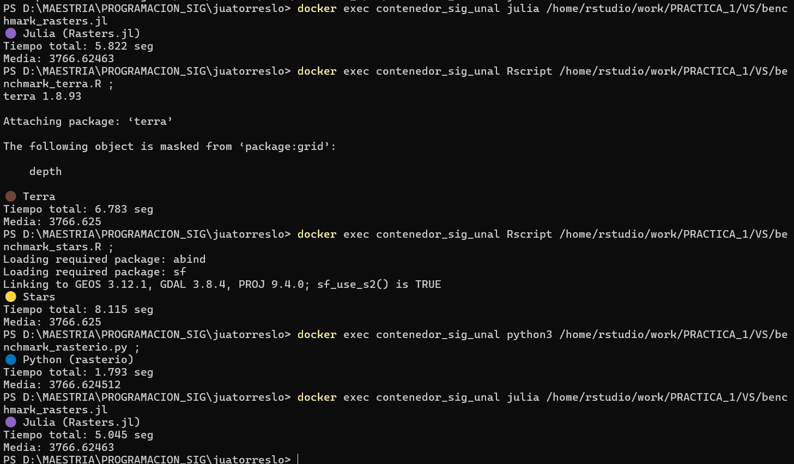

# Parte A — Ejecución en JupyterLab

## R — terra
Tiempo total: **6.907 segundos** 

Observación:
Tuvo un rendimiento intermedio en la prueba. El procesamiento se realizó en modo proxy, es decir, sin cargar completamente el raster en memoria, lo que permite trabajar de forma más eficiente con archivos grandes. 

---

## R — stars
Tiempo total: **10.219 segundos**

Observación:
Tuvo el mayor tiempo de ejecución. Aunque también permite trabajar en modo proxy, el tiempo total fue más alto que el de terra, se podría presumir entonces que el manejo interno del raster puede generar mayor sobrecarga en este tipo de operaciones que para otros motores puede resultar más sencilla.

---

## Python — rasterio
Tiempo total: **1.992 segundos**

Observación:
Fue el que obtuvo el mejor tiempo. En este caso, la banda se cargó como un arreglo NumPy en memoria y la operación se aplicó de forma vectorizada, es decir, sobre todos los valores al mismo tiempo. Esto reduce el tiempo de procesamiento en operaciones matemáticas simples como la multiplicación y el cálculo de la media.

---

## Julia — Rasters.jl
Tiempo total: **6.907 segundos**

Observación:
mostró un tiempo similar al de terra. Aunque Julia permite paralelismo, en esta prueba específica no se observó una diferencia significativa frente a R. 


# Parte B— Ejecución en VS Code     

## R — terra
Tiempo total: **2.387 segundos**
Media: **3766.624**
---

## R — stars
Tiempo total: **3.311 segundos**
Media: **3766.625**

---

## Python — rasterio
Tiempo total: **1.398 segundos**
Media: **3766.624**

---

## Julia — Rasters.jl
Tiempo total: **5.43 segundos**
Media: **3766.624**


## Parte C — Ejecución desde el Termina de Windows (PowerShell)

## R — terra
Tiempo total: **6.783 segundos**
Media: **3766.625**

## R — stars
Tiempo total: **8.115 segundos**
Media: **3766.625**

## Python — rasterio
Tiempo total: **1.793 segundos**
Media: **3766.624**

## Julia — Rasters.jl
Tiempo total: **5.045 segundos**
Media: **3766.624**


```{r}
#| label: fig-VSCode
#| fig-cap: "Resultados: Comparación de tiempos en PowerShell"
#| out-width: 70%




```

### Opción utilizada

Se utilizó la **Opción 2 — Ejecución directa**, ejecutando los scripts desde PowerShell mediante `docker exec`, por ejemplo:

docker exec contenedor_sig_unal Rscript benchmark_terra.R
docker exec contenedor_sig_unal Rscript benchmark_stars.R
docker exec contenedor_sig_unal Rscript benchmark_stars.R
docker exec contenedor_sig_unal python3 benchmark_rasterio.py


Esto permitió ejecutar directamente cada script dentro del contenedor sin ingresar manualmente al intérprete.

---

### Tiempos obtenidos en PowerShell (Docker)

- **R — terra:** 6.783 s  
- **R — stars:** 8.115 s  
- **Python — rasterio:** 1.793 s  
- **Julia — Rasters.jl:** 5.045 s  

Se observaron diferencias frente a JupyterLab y VSCode, especialmente en R y Julia.

---

#
---

### Tiempos obtenidos en PowerShell (Docker)

- **R — terra:** 6.783 s  
- **R — stars:** 8.115 s  
- **Python — rasterio:** 1.793 s  
- **Julia — Rasters.jl:** 5.045 s  

En general, los resultados fueron similares a los obtenidos en Jupyter y VSCode, aunque con pequeñas variaciones.

---

# Preguntas de análisis

---

## 1️. Entorno de ejecución

Sí se notaron algunas diferencias de tiempo entre:

- JupyterLab  
- VSCode  
- PowerShell con Docker

En Jupyter algunos tiempos fueron un poco mayores. Esto puede que se deba a que el entorno del laboratorio tiene más procesos activos.  

En VSCode y PowerShell la ejecución,  por lo que los tiempos fueron un poco menores, esto puede deberse a que no hay tantos procesos adicionales en ejecución.  

En el caso de Docker, puede haber una pequeña variación porque se está ejecutando dentro de un contenedor, aunque la diferencia no fue muy grande.

---

## 2️. Abstracción en la práctica

El motor donde más se nota el costo de las abstracciones es stars.

Aunque realiza la misma operación que los demás, sus tiempos fueron más altos en casi todos los entornos. Esto podría suponer que se está manejando más información, lo que hace que una operación tarde un poco más comparado con los otros motores.

En cambio, Python con rasterio fue más rápido.

---

## 3️.  Julia y el costo de compilación (Warm-up)

Sí se notó el efecto del "calentamiento" en Julia, especialmente en la primera ejecución.

Julia necesita compilar el código la primera vez que se ejecuta, por lo que el primer intento puede ser más lento. En ejecuciones posteriores el tiempo se redujo.


---

## 4️. Elección informada

Después de probar los tres entornos, mantendría la elección de Python con rasterio como la mejor opción, puesto que mostró el mejor rendimiento en todas las pruebas. Superando con diferencia a los otros motores, lo que lo hace una opción eficiente para este tipo de operaciones.

